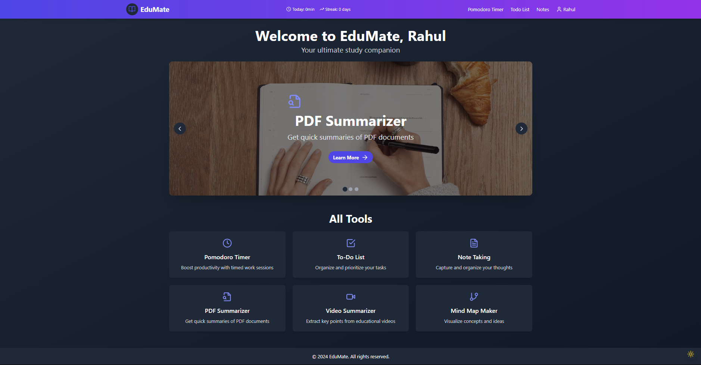

# EduMate 📚 - Your Ultimate Study Companion

<div align="center">



_Revolutionize your productivity. EduMate empowers every learner!_

[](https://reactjs.org/)
[](https://www.typescriptlang.org/)
[](https://tailwindcss.com/)
[](https://opensource.org/licenses/MIT)

</div>

## 📖 Table of Contents
- [Overview](#🌟-overview)
- [Key Highlights](#🌈-key-highlights)
- [Getting Started](#⚙️-getting-started)
- [Tech Stack](#🔧-tech-stack)
- [Screenshots](#📱-screenshots)
- [Why EduMate?](#🔍-why-edumate)
- [Contributing](#📦-contributing)
- [Acknowledgments](#🙏-acknowledgments)
- [License](#🔒-license)

## 🌟 Overview

EduMate is a comprehensive study companion designed to enhance your learning experience and boost productivity. With its suite of powerful tools and intuitive interface, EduMate helps students and professionals manage their study sessions effectively. Try it out at [https://edumate-five.vercel.app/](https://edumate-five.vercel.app)!

> **Note**: AI-powered features (PDF Summarizer, Video Summarizer) are currently under development and not yet functional. We're working hard to bring these exciting features to you soon!

## 🌈 Key Highlights

### 🕒 Pomodoro Timer
🎯 Flexible work-break cycles  
🔔 Background music and notifications  
📊 Session analytics  
🎮 Intuitive controls

### ✅ Smart Todo List
📌 Priority-based task management  
⏰ Due dates and reminders  
📂 Subtasks and categories  
📈 Progress tracking  
🏷️ Tag system for organization

### 📝 Note Taking
🖋️ Rich text editor  
📂 File organization system  
🏷️ Tags and categories  
📄 Export to PDF/Markdown  
💾 Auto-save functionality

### 📊 Analytics Dashboard
📉 Study session statistics  
📈 Productivity trends  
✅ Task completion rates  
🎯 Visual progress tracking  
🔥 Streak monitoring

### 🎯 Additional Tools
📜 PDF Summarizer (Coming Soon)  
🎥 Video Summarizer (Coming Soon)  
🧠 Mind Map Maker  
✨ And more coming soon!

## ⚙️ Getting Started

### Prerequisites
- Node.js (v14 or higher)
- npm or yarn

### Installation

1. Clone the repository
```bash
git clone https://github.com/yourusername/edumate.git
```

2. Install dependencies
```bash
cd edumate
npm install
```

3. Start the development server
```bash
npm run dev
```

4. Open [http://localhost:5173](http://localhost:5173) in your browser

## 🔧 Tech Stack

- [React](https://reactjs.org/) - UI Framework
- [TypeScript](https://www.typescriptlang.org/) - Programming Language
- [Vite](https://vitejs.dev/) - Build Tool
- [Tailwind CSS](https://tailwindcss.com/) - Styling
- [Framer Motion](https://www.framer.com/motion/) - Animations
- [Lucide React](https://lucide.dev/) - Icons

## 📱 Screenshots

<div align="center">
  <table>
    <tr>
      <td></td>
      <td></td>
    </tr>
    <tr>
      <td align="center">Pomodoro Timer</td>
      <td align="center">Dashboard</td>
    </tr>
  </table>
</div>

## 🔍 Why EduMate?

- **Intuitive Interface**: Clean and modern design for distraction-free studying
- **Cross-Platform**: Works seamlessly across desktop and mobile devices
- **Data Privacy**: Your data stays local and secure
- **Customizable**: Adapt the tools to your study style
- **Dark Mode**: Easy on the eyes during late-night study sessions

## 📦 Contributing

We welcome contributions! Please see our [Contributing Guidelines](CONTRIBUTING.md) for details.

1. Fork the repository
2. Create your feature branch (`git checkout -b feature/AmazingFeature`)
3. Commit your changes (`git commit -m 'Add some AmazingFeature'`)
4. Push to the branch (`git push origin feature/AmazingFeature`)
5. Open a Pull Request

## 📬 Contact

<div>
  <a href="https://edumate-five.vercel.app/" style="padding: 10px; font-size: 18px; text-decoration: none; background: #38B2AC; color: white; border-radius: 5px;">
    Try Live Demo
  </a>
</div>

Project Repository: [https://github.com/rahul100ni/Edumate](https://github.com/rahul100ni/Edumate)

---

<div align="center">
  <h3><i>EduMate</i>: Revolutionizing Learning, One Click at a Time</h3>
  <h3>Made with ❤️ by Rahul.</h3>
</div>
